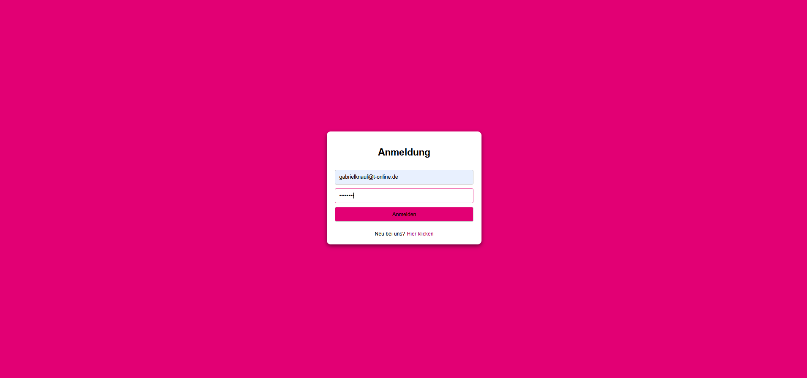

# Startpunkt-Projekt
Mein Startpunkt in der Programmierung – eine einfache Anmeldeseite, die als Starterprojekt zum Erlernen von HTML, CSS und Layout mit Flexbox und Grid erstellt wurde.
## Technologien
- HTML
- CSS

## Ziel
Layout, Flexbox und Grid üben.

## Verwendung
Öffne die Datei `index.html` im Browser.

## Screenshot
